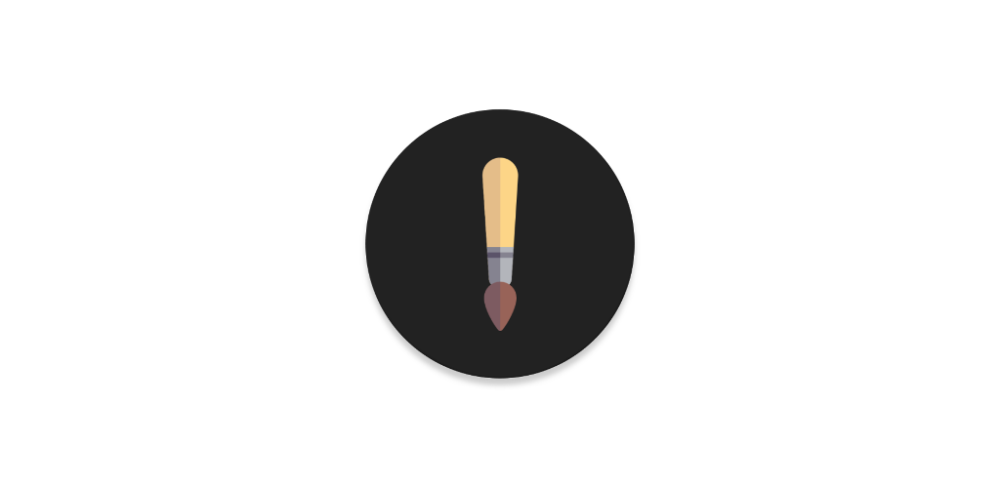
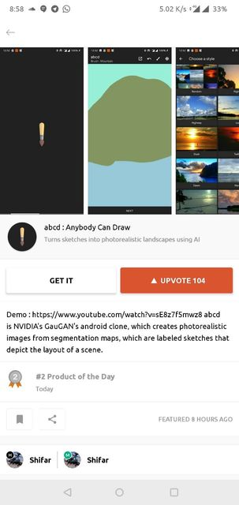

# abcd

Anybody can draw

## Download

## Happy Part

- The product was listed as #2 product of the day on 25th June 2019.
- [Ryan Hoover](https://twitter.com/rrhoover) up voted the project
- [Ming-Yu Liu](https://twitter.com/liu_mingyu) shot a direct message on twitter
- Created so many friends from the industry

## Sad Part

- NVIDIA guys reached me and asked me to remove it from producthunt as well as playstore, as I was using their servers.
The product removed from producthunt the same day, without any notice.

>Hello – We noticed you developed an app on our SPADE / “GauGAN” code and using our back-end servers to display the rendering output. Your app ‘abcd : Anybody Can Draw’ infringes on many legal issues. It would be of great interest to remove this app from the Google Play store as well as on ProductHunt.com.
> 
>Please do not hesitate to contact me if you have any questions.
> 
>Thank you,

then I replaced all NVIDIA resources with my own (even the style + artistic style images), to which they are replied

>The point was not having your own servers but how you turned GauGAN into a mobile app. This does not solve the problem.

and the final email was

>No need to talk further. I have already told you about your violations – you did not invent the AI, all you did was build the mobile app around our intellectual property.
>
> 
>
>Please remove asap before our legal is involved.

and I had to remove it from playstore :(

The full fight can be downloaded from [here](nvida_vs_abcd.pdf)

 

## Proud Part

- I removed all nvidia resources, even the style/art-style images, from the app and hosted a server myself.

## Issues

If you are happen to face any bugs, feel free to rise an issue [here](https://github.com/theapache64/abcd/issues/new)

## Contribution

The project follows MVVM architecture, and powered by

- Dagger 2
- ViewModel
- LiveData
- Data Binding
- Retrofit
- OkHttp (only for getting result image)

If you've basic knowledge in above stack, feel free to create PR to anything (features/bug fixes/anything)

### TODO

- Gallery
- Upload to Gallery
- Like post
 

### Author

theapache64
